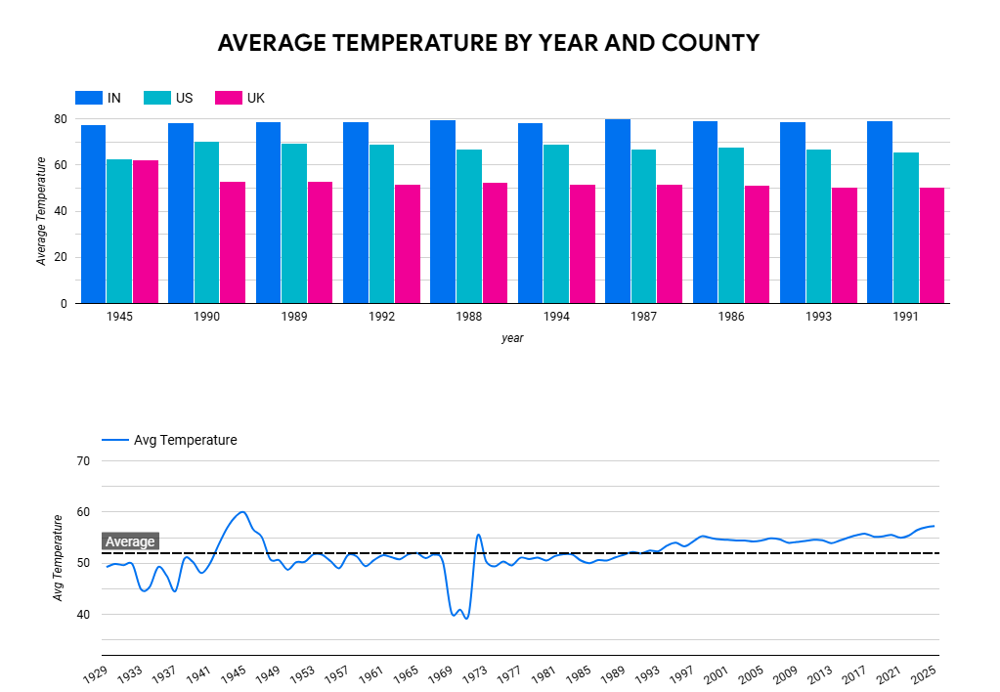
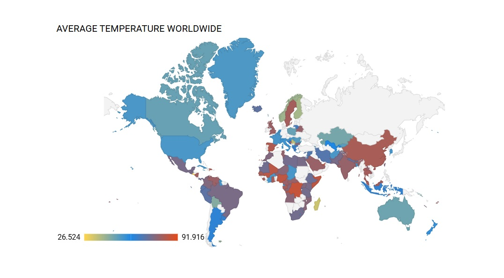
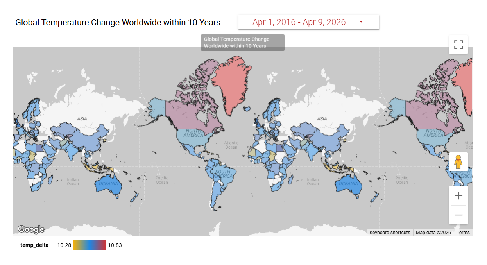

# Global Temperature Analysis with BigQuery and Looker Studio

## Project Overview
This project explores global temperature patterns using Google BigQuery for data preparation and Looker Studio for interactive visualisation. The dashboard focuses on three core views:

- average temperature by year and country
- average temperature worldwide
- global temperature change worldwide within 10 years

## Project Objective
The goal of this project is to transform raw temperature data into analysis-ready BigQuery tables and views, then use Looker Studio to communicate temperature patterns through comparison charts, trend lines, and global maps.

## Tools and Technologies
- Google BigQuery
- SQL
- Looker Studio
- Google Cloud Platform
- Python notebook for data access and exploration

## Data Source and Workspace
- Google Cloud Project: `global-temperature-429612`
- BigQuery Dataset: `GlobalTempGSOD`
- Notebook: [GlobalTempGSOT.ipynb](./GlobalTempGSOT.ipynb)

BigQuery dataset link:
[Open BigQuery Dataset](https://console.cloud.google.com/bigquery?ws=!1m4!1m3!3m2!1sglobal-temperature-429612!2sGlobalTempGSOD)

Looker Studio dashboard:
[Open Dashboard](https://lookerstudio.google.com/u/0/reporting/d3b74624-32d4-4b34-b1aa-13e59c88a68a/page/tEnnC)

## BigQuery Data Preparation
The dashboard is supported by a set of tables and views created in BigQuery to organise the data for time-based, country-based, and geographic analysis.

### Tables and Views
- `iso-country-codes`
- `tblAVGTemp190s`
- `tblGeoTemp`
- `tbl_DateTime_AvgTemp`
- `tbl_YearlyAvgTemperature`
- `tbl_YearlyMeanTeamp`

These objects were used to structure the temperature data into reusable reporting layers for Looker Studio.

### Included SQL File
- [qry_DateTime_AvgTemp.sql](./sql/qry_DateTime_AvgTemp.sql)

This query creates a date-based temperature dataset by:
- calculating average temperature by country and year
- converting the year into a `DATETIME` field for time-based reporting
- calculating a baseline temperature by country
- generating `temp_delta` to compare yearly temperature against the baseline

## Analytical Workflow
1. Loaded and explored the temperature dataset in Google BigQuery.
2. Created reporting tables and views for yearly, geographic, and date-based analysis.
3. Connected the prepared data to Looker Studio.
4. Built dashboard views to compare countries, show long-term trends, and map worldwide temperature patterns.
5. Interpreted the results to identify meaningful global temperature insights.

## Dashboard Views

### 1. Average Temperature by Year and Country

This dashboard view combines a country comparison bar chart for India, the United States, and the United Kingdom with a long-term average temperature trend line and an average reference line.

**What this shows**
- India remains the warmest of the three compared countries.
- The United States sits in the middle range.
- The United Kingdom remains the coolest of the three.
- The long-term trend line suggests more recent years are often above the historical average.
- The dashboard allows readers to compare both country-level differences and time-based movement in one place.

### 2. Average Temperature Worldwide

This choropleth map shows how average temperature varies across countries worldwide.

**What this shows**
- Average temperature differs significantly by geography.
- Warmer temperatures appear more strongly in lower-latitude and tropical regions.
- Cooler average temperatures are more visible in higher-latitude regions.
- The map gives a clear global view of how unevenly average temperature is distributed.

### 3. Global Temperature Change Within 10 Years

This map highlights temperature change by country over the selected 10-year period.

**What this shows**
- Temperature change is global in scale, but uneven in intensity.
- Many countries show warming over the selected period.
- Some regions appear to change more strongly than others.
- The date filter makes it possible to explore recent change dynamically over time.

## Key Findings
- Temperature patterns differ clearly across countries and world regions.
- India appears consistently warmer than the United States and the United Kingdom in the country comparison chart.
- The long-term average temperature trend suggests a broader warming pattern in more recent years.
- Geography is a major factor in average temperature variation.
- Recent temperature change appears widespread, although the size of change differs by country.

## Why This Project Matters
This project demonstrates how cloud-based analytics tools can be combined to move from raw data to a final interactive report. BigQuery was used to prepare structured analytical data, while Looker Studio was used to turn that data into a readable visual story for non-technical audiences.

## Repository Contents
- [README.md](./README.md): project overview, dashboard summary, and key findings
- [INSIGHTS_REPORT.md](./INSIGHTS_REPORT.md): detailed interpretation of the dashboard results
- [GlobalTempGSOT.ipynb](./GlobalTempGSOT.ipynb): notebook used to connect to and inspect BigQuery data
- [sql/qry_DateTime_AvgTemp.sql](./sql/qry_DateTime_AvgTemp.sql): BigQuery SQL used to prepare time-based temperature analysis
- `images/`: dashboard screenshots used in the README

## Conclusion
This project demonstrates an end-to-end analytics workflow using Google BigQuery and Looker Studio. It shows how raw global temperature data can be transformed into reporting-ready tables, visualised through interactive dashboards, and interpreted in a clear portfolio-ready format.
